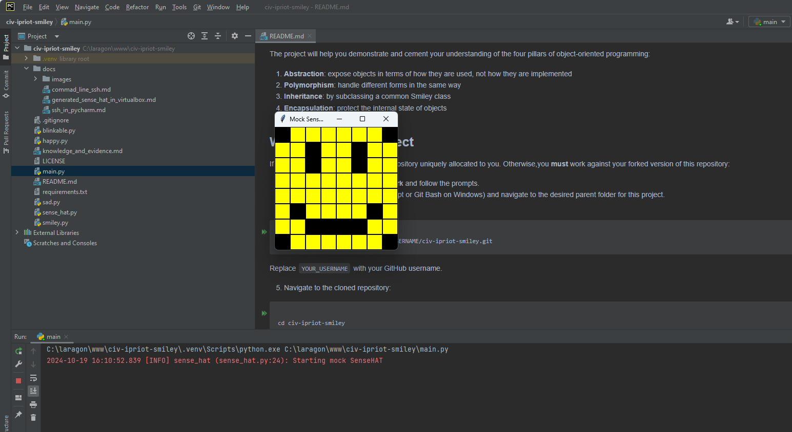
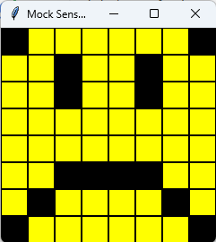
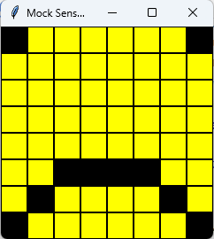
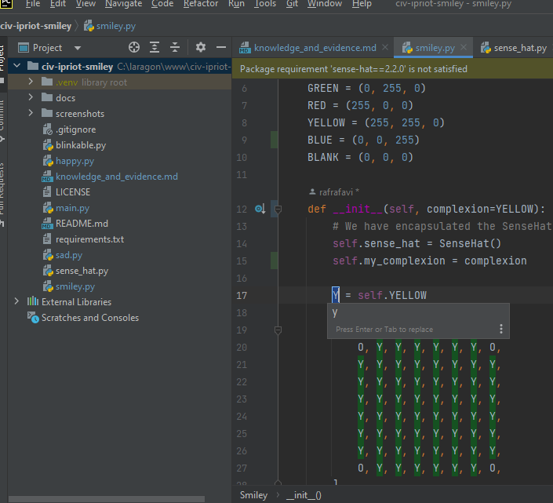

<style>

body {
    counter-reset: h2counter;
}

/* H1 - No numbering */
h1 {
    /* No counter reset or increment */
}

/* H2 - Level 1 numbering */
h2 {
    counter-reset: h3counter;
}

h2::before {
    counter-increment: h2counter;
    content: counter(h2counter) ". ";
}

/* H3 - Level 2 numbering */
h3 {
    counter-reset: h4counter;
}

h3::before {
    counter-increment: h3counter;
    content: counter(h2counter) "." counter(h3counter) " ";
}

/* H4 - Level 3 numbering (optional) */
h4 {
    counter-reset: h5counter;
}

h4::before {
    counter-increment: h4counter;
    content: counter(h2counter) "." counter(h3counter) "." counter(h4counter) " ";
}

</style>

# Evidence and Knowledge

This document includes instructions and knowledge questions that must be completed to receive a *Competent* grade on this portfolio task.

## Required evidence

### Answer all questions in this document

- Each answer should be complete, well-articulated, and within the specified word count limits (if added) for each question.
- Please make sure **all** external sources are properly cited.
- You must **use your own words**. Please include your full chat transcripts if you use generative AI in any way.
- Generative AI hallucinates, is not an authoritative source

### Make all the required modifications to the code

- Please follow the instructions in this document to make the changes needed to the code.

- When requested to upload evidence, upload all screenshots to `screenshots/` and embed them in this document. For example:

```markdown

```

- You must upload the code into your GitHub repository.
- While you can use a branch, your code should be in main when you submit.
- Upload a zip of this repository to Blackboard when you are ready to submit.
- You will be notified of your result via Blackboard
- However, if using GitHub classrooms, you may also receive additional feedback on GitHub directly

### Optional: Use of Raspberry Pi and SenseHat

Raspberry Pi or SenseHat is **optional** for this activity. You can use the included `sense_hat.py` file to simulate the SenseHat on your computer.

If you use a Pi, please **delete** the `sense_hat.py` file.

### Accessible version of the code

This project relies on visual patterns that appear on an LED matrix. If you have any accessibility requirements, you can use the `udl/accessible` branch to complete the project. This branch provides an accessible code version that uses text-based patterns instead of visual ones.

Please discuss this with your lecturer before using that branch.

## Specific Tasks & Questions

Address the following tasks and questions based on the code provided in this repository.

### Set up the project locally

1. Fork this repository (if not using GitHub Classrooms)
2. Clone your repository locally
3. Run the project locally by executing the `main.py` file
4. Evidence this by providing screenshots of the project directory structure and the output of the `main.py` file



If you are running on a Raspberry Pi, you can use the following command to run the project and then screenshot the result:

```bash
ls
python3 main.py
```

### Fundamental code comprehension

 Answer each of the following questions **as they relate to that code** supplied by in this repository (ignore `sense_hat.py`):

1. Examine the code for the `smiley.py` file and provide  an example of a variable of each of the following types and their corresponding values (`_` should be replaced with the appropriate values):

   | Type                    | name           | value                  |
   |----------------|------------------------| -------------- |
   | built-in primitive type | dimmed         | True          |
   | built-in composite type | WHITE          | (255, 255, 255) |
   | user-defined type       | self.sense_hat | SenseHat()     |

2. Fill in (`_`) the following table based on the code in `smiley.py`:

   | Object                   | Type   |
   |--------| ----------------------- |
   | self.pixels              | list   |
   | A member of self.pixels  | tuple  |
   | self                     | object |

3. Examine the code for `smiley.py`, `sad.py`, and `happy.py`. Give an example of each of the following control structures using an example from **each** of these files. Include the first line and the line range:

   | Control Flow | File     | First line  | Line range |
   |----------| ---------- |------------| ----------- |
   |  sequence    | happy.py | self.draw_eyes(wide_open=False)| 39-43      |
   |  selection   | sad.py   | if wide_open: | 26-30      |
   |  iteration   | happy.py | for pixel in mouth: | 21-22      |

4. Though everything in Python is an object, it is sometimes said to have four "primitive" types. Examining the three files `smiley.py`, `sad.py`, and `happy.py`, identify which of the following types are used in any of these files, and give an example of each (use an example from the code, if applicable, otherwise provide an example of your own):

   | Type                    | Used? | Example            |
   |-------|--------------------| --------|
   | int                     | No    | age=9              |
   | float                   | Yes   | delay=0.25         |
   | str                     | No    | user_input="Hello" |
   | bool                    | Yes   | wide_open=True     |

5. Examining `smiley.py`, provide an example of a class variable and an instance variable (attribute). Explain **why** one is defined as a class variable and the other as an instance variable.

> In smiley.py, an example of a class variable is WHITE = (255, 255, 255) and an example of an instance variable is self.sense_hat = SenseHat(). The class variable is defined outside any method within the class, making it a shared variable across all instances of the class, whereas the instance variable is defined within a method of a class and is unique to the instance of that class.
>

6. Examine `happy.py`, and identify the constructor (initializer) for the `Happy` class:
   1. What is the purpose of a constructor (in general) and this one (in particular)?

   > A constructor in general, sets up the initial state of the instance of the class. In the Happy class, the constructor initialises the mouth and the eyes on the self instance of the class.
   >

   2. What statement(s) does it execute (consider the `super` call), and what is the result?

   > The constructor in the Happy class initially calls super().__init__() which triggers the initialisation of the parent classes, Smiley and Blinkable. This allows the Happy class to inherit properties and methods from the parent classes.
   > The class then goes on to call the draw_mouth() and draw_eyes() methods, which define the mouth and eyes on the face inherited from the parent class Smiley.

### Code style

1. What code style is used in the code? Is it likely to be the same as the code style used in the SenseHat? Give to reasons as to why/why not:
   
> PEP-8 is used. It is likely to be used in the SenseHat given the prevalence in the other python files, but can not be definitively stated.
>

2. List three aspects of this convention you see applied in the code.

> Examples of the PEP-8 style in the code are below:
> - The use of docstrings to explain the function of the classes and methods.
> - The use of meaningful variables that aren't abbreviated.
> - The use of single line spacing between methods within a class, double line spacing between imports and classes, and 4 space indentations.
>

3. Give two examples of organizational documentation in the code.

> - In the smiley.py file, there is the docstring for the dim_display method that explains what the intended outcome of the method is, and what the dimmed parameter does when passed through to the method.
> - In the smiley.py file, there is the comment on line 12 that explains what the proceeding line of code is.
>

### Identifying and understanding classes

> Note: Ignore the `sense_hat.py` file when answering the questions below

1. List all the classes you identified in the project. Indicate which classes are base classes and which are subclasses. For subclasses, identify all direct base classes.
  
  Use the following table for your answers:

| Class Name | Super or Sub? | Direct parent(s)  |
|------------|---------------|-------------------|
| Happy      | Sub           | Smiley, Blinkable |
| Smiley     | Sub           | SenseHat          |
| SenseHat   | Super         | -                 |
| Blinkable  | Sub           | ABC               |
| Sad        | Sub           | Smiley            |
| ABC        | Super         | -                 |

2. Explain the concept of abstraction, giving an example from the project (note "implementing an ABC" is **not** in itself an example of abstraction). (Max 150 words)

> Abstraction is where a class defines the foundation for which other classes are based but isn't instantiated. Within the project, the Blinkable class has an abstract method call blink.
>

3. What is the name of the process of deriving from base classes? What is its purpose in this project? (Max 150 words)

> This is called Inheritance. It allows a child class to use the parent/s class methods and properties. In this way, it re-uses already existing code, thus simplifying the program and avoiding duplication.
>

### Compare and contrast classes

Compare and contrast the classes Happy and Sad.

1. What is the key difference between the two classes?
   > The Happy class defines a blink method modelled on the abstract Blinkable class. The other difference is that the list that defines the pixels for the mouth in the draw_mouth method are different.
   >
2. What are the key similarities?
   > Happy and Sad both inherit attributes and methods from the Smiley class, and both also have defined methods for drawing the mouth and eyes
   >
3. What difference stands out the most to you and why?
   > The main difference that stands out is the blink method. It is an entire new function in the Happy class that doesn't exist in the Sad class.
   >
4. How does this difference affect the functionality of these classes
   > The Sad class does not have the ability to trigger the blinking of the eyes, unlike the Happy class.
   >

### Where is the Sense(Hat) in the code?

1. Which class(es) utilize the functionality of the SenseHat?
   > The SenseHat is used in the Smiley, Happy, and Sad classes.
   >
2. Which of these classes directly interact with the SenseHat functionalities?
   > The Smiley class directly interacts with the functionalities of the SenseHat.
   >
3. Discuss the hiding of the SenseHAT in terms of encapsulation (100-200 Words)
   > The Smiley class utilises the functionality of the SenseHat class when the Smiley class is instantiated, and in doing so it becomes an instance variable that is accessed by calling the dim_display or show methods of the instantiated Smiley class. Seeing as the Smiley classes methods are the only way to access the functionality of the SenseHat class, this is said to hide the SenseHat class by having the Smiley class encapsulate the SenseHat class. This creates a structured way of accessing the functionality of the SenseHat class, not only protecting the SenseHat class from direct manipulation or changes in the process, but also simplifies a somewhat complex program by compartmentalisation and code segregation making it easier to maintain, easier to make improvements, and easier for another coder or high level user to understand. 
   >

### Sad Smileys Can’t Blink (Or Can They?)

Unlike the `Happy` smiley, the current implementation of the `Sad` smiley does not possess the ability to blink. Let's first explore how blinking has been implemented in the Happy Smiley by examining the blink() method, which takes one argument that determines the duration of the blink.

**Understanding Blink Mechanism:**

1. Does the code's author believe that every `Smiley` should be able to blink? Explain.

> No. If this was the case, then the blink method would be defined in the Smiley class.
>

2. For those smileys that blink, does the author expect them to blink in the same way? Explain.

> No. The addition of an optional argument to the blink method that controls the speed at which a Smiley blinks infers that not all Smiley's blink the same way.
>

3. Referring to the implementation of blink in the Happy and Sad Smiley classes, give a brief explanation of what polymorphism is.

> Polymorphism is the ability for something to be presented in different ways or forms. In the case of the Happy class, the blink method actions the blink specific to that emoji. Sad or any other emoji that has the blink method can adjust the application of the blink method within the emoji class to suit. Whilst the end appearance on the emoji may look different, the action of blinking is still used.
>

4. How is inheritance used in the blink method, and why is it important for polymorphism?

> By inheriting the abstract method blink from the Blinkable class, it defines the base application of the method for blink. In this sense, the use of a blink method in an emoji can then expand further on the application of the method without impacting its use in other emoji's implementation of it. This is important to polymorphism because it allows the blink action to be implemented in different ways.
>
1. **Implement Blink in Sad Class:**

   - Create a new method called `blink` within the Sad class. Ensure you use the same method signature as in the Happy class:

   ```python
   def blink(self, delay=0.25):
       pass  # Replace 'pass' with your implementation
   ```

2. **Code Implementation:** Implement the code that allows the Sad smiley to blink. Use the implementation from the Happy Smiley as a reference. Ensure your new method functions similarly by controlling the blink duration through the `delay` argument.

3. **Testing the Implementation:**

- Test the new blink functionality on your Raspberry Pi or within the Python classes provided. You might need to adjust the `main.py` script to incorporate Sad Smiley's new blinking capability.

Include a screenshot of the sad smiley or the modified `main.py`:




- Observe and document the Sad smiley as it blinks its eyes. Describe any adjustments or issues encountered during implementation.

  > The initial implementation had the Sad smiley start with its eyes open, and then closed them, but did not open them again. To address this, the time module was imported into the sad.py file. Afterwards the Sad smiley opens its eyes after closing them to complete the blink. 

  ### If It Walks Like a Duck…

  Previously, you implemented the blink functionality for the Sad smiley without utilizing the class `Blinkable`. Assuming you did not use `Blinkable` (even if you actually did), consider how the Sad smiley could blink similarly to the Happy smiley without this specific class.

  1. **Class Type Analysis:** What kind of class is `Blinkable`? Inspect its superclass for clues about its classification.

     > Blinkable is an abstract class

  2. **Class Implementation:** `Blinkable` is a class intended to be implemented by other classes. What generic term describes this kind of class, which is designed for implementation by others? **Clue**: Notice the lack of any concrete implementation and the naming convention.

  > A generic term for a class designed to be implemented by others is a Interface.

  3. **OO Principle Identification:** Regarding your answer to question (2), which Object-Oriented (OO) principle does this represent? Choose from the following and justify your answer in 1-2 sentences: Abstraction, Polymorphism, Inheritance, Encapsulation.

  > Blinkable is an example of Polymorphism as it is designed to be a template from which other classes can implement. These subclasses can then expand/adjust the implementation whilst adhering to the base structure of the superclass. 

  4. **Implementation Flexibility:** Explain why you could grant the Sad Smiley a blinking feature similar to the Happy Smiley's implementation, even without directly using `Blinkable`.

  > The blinking feature could be implemented due to inheritance from the Smiley and SenseHat super classes. The Blinkable class is intended to be a base template reference from which the blink method can be structured around, but this does not preclude a blink method being implemented as the implementation is derived from the super classes.

  5. **Concept and Language Specificity:** In relation to your response to question (4), what is this capability known as, and why is it feasible in Python and many other dynamically typed languages but not in most statically typed programming languages like C#? **Clue** This concept is hinted at in the title of this section.

  > This works in Python because it is duck-typed where an object is what it is based on what it implements. Statically typed or compiled languages rely on defining an object from the outset, and they can not change.

  ***

  ## Refactoring

  ### Does a Smiley Have to Be Yellow?

  While our current implementation predominantly features yellow smileys, emotional expressions like sickness or anger typically utilize colors like green, red, or orange. We'll explore the feasibility of integrating these colors into our smileys.

  1. **Defined Colors and Their Location:**

     1. Which colors are defined and in which class(s)?
        > The colours White, Green, Red, and Yellow are defined in the Smiley class
     2. What type of variables hold these colors? Are the values expected to change during the program's execution? Explain your answer.
        > These colours are class variables of type tuple, and they are not expected to change. The RGB values for the colours are constant, and if a new colour is required then it should form a new tuple variable.
     3. Add the color blue to the appropriate class using the appropriate format and values.

  2. **Usage of Color Variables:**

     1. In which classes are the color variables used?
        > The colour variables are used in the Smiley, Happy, and Sad classes.

  3. **Simple Method to Change Colors:**
  4. What is the easiest way you can think to change the smileys to green? Easiest, not necessarily the best!
     > In the Smiley class, change the RGB values of the YELLOW tuple to the same as GREEN.

  Here's a revised version of the "Flexible Colors – Step 1" section for the smiley project, incorporating your specifications for formatting and content updates:

  ### Flexible Colors – Step 1

  Changing the color of the smileys once is straightforward, but it isn't very flexible. To facilitate various colors for smileys, it is advisable not to hardcode values in any class. This approach was identified earlier as a necessary change. Let's start by removing the built-in assumptions about color in our classes.

  1. **Add a method called `complexion` to the `Smiley` class:** Implement this instance method to return `self.YELLOW`. Using the term "complexion" instead of "color" provides a more abstract terminology that focuses on the meaning rather than implementation.

  2. **Refactor subclasses to use the `complexion` method:** Modify any subclass that directly accesses the color variable to instead utilize the new `complexion` method. This ensures that color handling is centralized and can be easily modified in the future.

  3. **Determine the applicable Object-Oriented principle:** Consider whether Abstraction, Polymorphism, Inheritance, or Encapsulation best applies to the modifications made in this step.

  4. **Verify the implementation:** Ensure that the modifications function as expected. The smileys should still display in yellow, confirming that the new method correctly replaces the direct color references.

  This step is crucial for setting up a more flexible system for color management in the smiley display logic, allowing for easy adjustments and extensions in the future.

  ### Flexible Colors – Step 2

  Having removed the hardcoded color values, we now enhance the base class to support dynamic color assignments more effectively.

  1. **Modify the `__init__()` method in the `Smiley` class:** Introduce a default argument named `complexion` and assign `YELLOW` as its default value. This allows the instantiation of smileys with customizable colors.

  2. **Introduce a new instance variable:** Create a variable called `my_complexion` and assign the `complexion` parameter to it. This step ensures that each smiley instance can maintain its own color state.

  3. **Rationale for `my_complexion`:** Using a distinct instance variable like `my_complexion` avoids potential conflicts with the method parameter names and clarifies that it is an attribute specific to the object.

  4. **Bulk rename:** We want to update our grid to use the value of complexion, but we have so many `Y`'s in the grid. Use your IDE's refactoring tool to rename all instances of the **symbol** `Y` to `X`. Where `X` is the value of the `complexion` variable. Include a screenshot evidencing you have found the correct refactor tool and the changes made.

  

  5. **Update the `complexion` method:** Adjust this method to return `self.my_complexion`, ensuring that whatever color is assigned during instantiation is what the smiley displays.

  6. **Verification:** Run the updated code to confirm that Smileys still defaults to yellow unless specified otherwise.

  ### Flexible Colors – Step 3

  With the foundational changes in place, it's now possible to implement varied smiley colors for different emotional expressions.

  1. **Adjust the `Sad` class initialization:** In the `Sad` class's initializer method, change the superclass call to include the `complexion` argument with the value `self.BLUE`, as shown:

     ```python
     super().__init__(complexion=self.BLUE)
     ```

  2. **Test color functionality for the Sad smiley:** Execute the program to verify that the Sad smiley now appears blue.

  3. **Ensure the Happy smiley remains yellow:** Confirm that changes to the Sad smiley do not affect the default color of the Happy smiley, which should still display in yellow.

  4. **Design and Implement An Angry Smiley:** Create an Angry smiley class that inherits from the `Smiley` class. Set the color of the Angry smiley to red by passing `self.RED` as the `complexion` argument in the superclass call.

  ***
